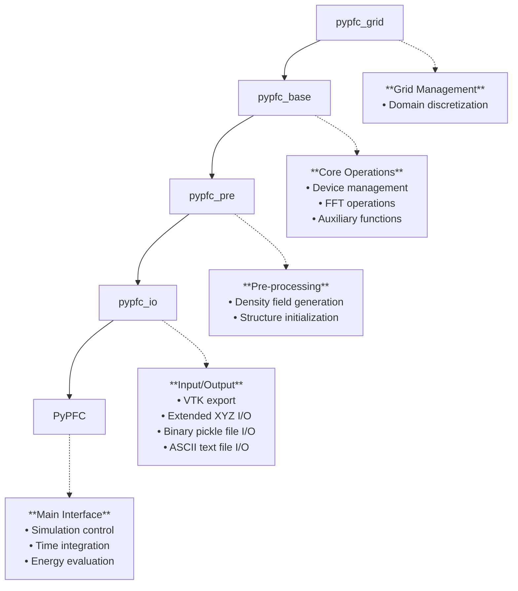

# Core Classes

This section documents the core classes, the structure and the coding conventions of the pyPFC framework.

## Code Conventions

### Naming Conventions

- A variable with a trailing `_d` indicates a quantity residing on the `device`, which can be either `cpu` or `gpu`.
- A variable name with a leading `f_` indicates a complex-type quantity that is set in Fourier space.
- Names of variables, functions and methods, etc., follow the snake case convention, with words in lower-case letters, separated by underscores. For example: `a_variable_name`
- Private methods and attributes should start with a single underscore: `_internal_method()`

### Memory and Performance

- Floating point precision of variables is declared by the class variables `dtype_cpu` and `dtype_gpu` for quantities residing on the `cpu` and `gpu`, respectively. This permits easy control of the overall precision used in a pyPFC simulation.
- Use in-place tensor operations when possible to minimize memory allocation: `tensor.add_(other)` instead of `tensor + other`
- Ensure all PyTorch tensors are contiguous for optimal FFT performance: `tensor.contiguous()`
- Free GPU memory explicitly in long-running simulations: `torch.cuda.empty_cache()`

### Error Handling and Validation

- Input parameters should be validated (e.g., an even number of grid divisions)
- Use descriptive error messages that include context and suggested solutions
- Raise appropriate exception types: `ValueError` for invalid parameters, `RuntimeError` for computational failures
- Include parameter bounds checking for physical quantities (e.g., positive time steps, reasonable grid sizes)

### Physical Units and Dimensionality

- All spatial dimensions are expressed in units of the lattice parameter (non-dimensional)
- Time evolution occurs in non-dimensional time units
- Document the physical interpretation of non-dimensional parameters in docstrings
- Use meaningful variable names that reflect physical quantities (e.g., `time_step`)

### Code Organization

- Keep functions focused on a single responsibility (single responsibility principle)
- Limit function length when possible for readability
- Group related functionality into logical class hierarchies following the inheritance chain
- Separate configuration parameters from computational code
- Use type hints for all function parameters and return values:

  ```python
  def evolve_field(density: torch.Tensor, time_step: float) -> torch.Tensor:
  ```

### Testing and Reproducibility

- Include assertions for critical computational assumptions
- Provide deterministic behavior when possible (set random seeds if using random numbers)
- Write functions that can be easily unit tested (avoid deep side effects)
- Include numerical tolerance checks for floating-point comparisons:

  ```python
    assert torch.allclose(result, expected, rtol=1e-6, atol=1e-9)
  ```

### Scientific Computing Best Practices

- Prefer vectorized operations over explicit loops
- Document the mathematical basis for numerical algorithms in docstrings
- Include references to relevant literature for implemented methods
- Validate numerical stability and convergence properties
- Provide performance characteristics (computational complexity) for expensive operations

## Documentation Conventions

When adding new functions or methods, docstrings must follow MkDocs-compatible format for proper API documentation generation:

### Function Docstring Format

```python
def example_function(param1, param2=None):
    """Brief description of the function.
    
    Detailed description of what the function does, including any important
    implementation details or usage notes.
    
    Args:
        param1 (type): Description of param1.
        param2 (type, optional): Description of param2. Defaults to None.
        
    Returns:
        type: Description of return value.
        
    Raises:
        ValueError: If param1 is invalid.
        RuntimeError: If computation fails.
        
    Example:
        ```python
        result = example_function("test", param2=42)
        print(result)
        ```
        
    Note:
        Any additional notes about usage, performance, or limitations.
    """
```

### Class Docstring Format

```python
class ExampleClass:
    """Brief description of the class.
    
    Detailed description of the class purpose and functionality.
    
    Attributes:
        attr1 (type): Description of attribute.
        attr2 (type): Description of attribute.
        
    Example:
        ```python
        obj = ExampleClass()
        obj.method_name()
        ```
    """
```

### Key MkDocs Requirements

- Use **triple quotes** for all docstrings
- Include **Args**, **Returns**, and **Raises** sections where applicable
- Use **type hints** in parentheses: `param (torch.Tensor):`
- Provide **code examples** in fenced code blocks with `python` language tag
- Keep **first line brief** and follow with detailed description
- Use **proper Markdown formatting** within docstrings

## Configuration Parameters

The general behavior of pyPFC is controlled by a set of configuration parameters, collected in a Python dictionary. The parameters are described in the table below.

| Parameter name         | Defaults to                       | Description
| ---------------------- | --------------------------------- | ---------------------------------------------------------------------------------
| alat                   | 1.0                               | Lattice parameter (non-dimensional)
| alpha                  | [1, 1]                            | Gaussian peak widths in the pair correlation function $C_2$, excluding the zero-mode peak
| C20_amplitude          | 0.0                               | Amplitude of the zero-mode Gaussian peak in $C_2$
| C20_alpha              | 1.0                               | Width of the zero-mode Gaussian peak in $C_2$
| density_interp_order   | 2                                 | Interpolation order for density maxima localization
| density_merge_distance | 0.1                               | Distance for merging density maxima (in units of lattice parameters)
| density_threshold      | 0.5                               | Threshold for density maxima detection
| device_number          | 0                                 | GPU device number (if multiple GPUs are available)
| device_type            | 'gpu'                             | PyTorch device ('cpu' or 'gpu')
| dtime                  | 1.0e-3                            | Non-dimensional time increment $\Delta\tau$
| dtype_cpu              | np.double                         | Floating-point precision of numpy arrays
| dtype_gpu              | torch.float64                     | Floating-point precision of PyTorch tensors
| evaluate_phase_field   | True                              | Evaluate phase field (or not)
| normalize_pf           | True                              | Normalize the phase fields to [0,1], or not
| npeaks                 | 2                                 | Number of Gaussian peaks, excluding the zero-mode peak, to use in $C_2$
| pf_gauss_var           | 0.1                               | Variance of the Gaussian smoothing kernel used in phase field evaluations
| pf_iso_level           | 0.5                               | Iso-level for phase field contouring
| sigma                  | 0.0                               | Temperature-like parameter (non-dimensional)
| struct                 | 'FCC'                             | Crystal structure
| torch_threads          | 8                                 | Number of CPU threads to use if device_type is 'cpu'
| torch_threads_interop  | 8                                 | Number of interop threads to use if device_type is 'cpu'
| update_scheme          | '1st_order'                       | Time integration scheme ('1st_order', '2nd_order' or 'exponential')
| update_scheme_params   | [1.0, 1.0, 1.0, None, None, None] | Parameters in the time integration scheme: $[g_1, g_2, g_3, \alpha, \beta, \gamma]$
| verbose                | True                              | Verbose output (or not)

## pyPFC Architecture Overview

The pyPFC framework follows a strict inheritance hierarchy designed for modularity and extensibility:



## Performance Considerations

### Memory Usage

Note that the numbers below are only indicative. Adding additional field, such as extra phase fields, will significantly increase memory usage.

| Grid Size | Double Precision | Single Precision
|-----------|------------------|-----------------
| 256³      | ~2 GB            | ~1 GB
| 512³      | ~14 GB           | ~7 GB
| 768³      | ~45 GB           | ~23 GB

### Optimization Tips

```python
# For maximum performance
params_fast = {
    'device_type': 'GPU',       # Run on GPU
    'dtype_cpu':  np.single,    # Floating point precision, CPU
    'dtype_gpu': torch.float32, # Floating point precision, GPU
    'density_interp_order': 1,  # Reduced interpolation accuracy
}

# For maximum accuracy
params_precise = {
    'device_type': 'GPU',       # Run on GPU 
    'dtype_cpu': np.double,     # Floating point precision, GPU
    'dtype_gpu': torch.float64, # Floating point precision, GPU
    'density_interp_order': 3,  # Better interpolation accuracy
}
```

## Usage Examples

Usage examples can be found on the [Examples pages](../examples.md).
