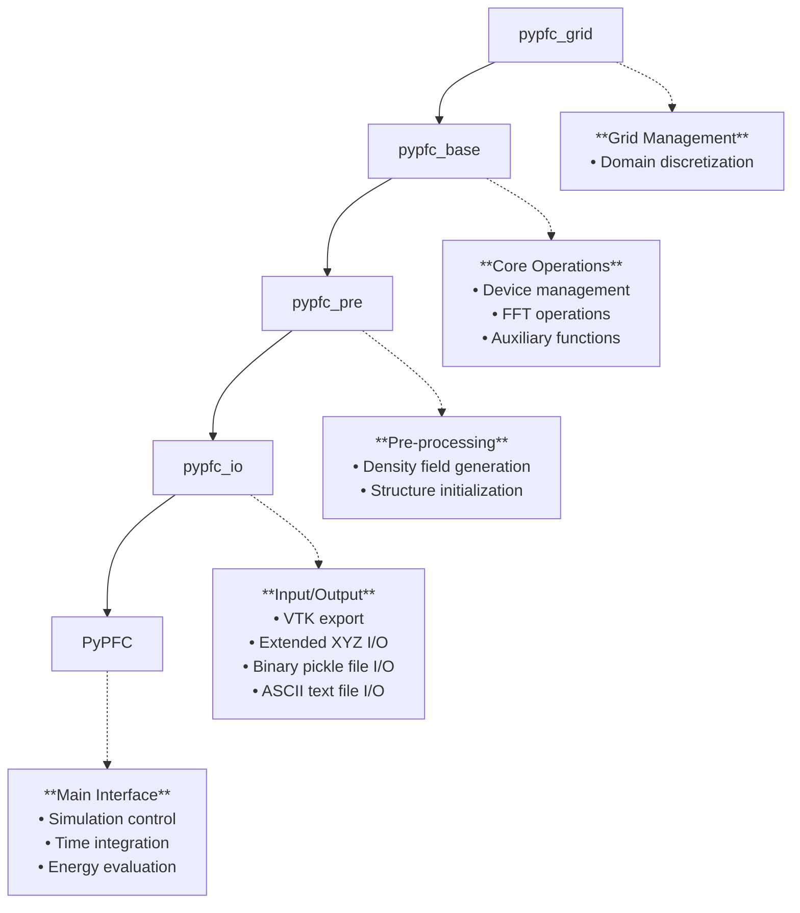

# Core Classes

This section documents the core classes, the structure and the coding conventions of the pyPFC framework.

## General Comments

- pyPFC runs simulations on a regular Cartesian 3D grid with periodic boundary conditions along all coordinate axes. This is due to that pyPFC employs spectral solution schemes with heavy use of FFTs and.
- pyPFC evolves the density field in non-dimensional time and spatial dimensions are expressed in units of the lattice parameter.

## Code Conventions

- A variable with a trailing `_d` indicates a quantity residing on the `device`, which can be either `cpu` or `gpu`.
- A variable name with a leading `f_` indicates a complex-type quantity that is set in Fourier space.
- Names of variables, functions and methods, etc., follow the snake case convention, with words in lower-case letters, separated by underscores. For example: `a_variable_name`
- Floating point precision of variables is declared by the class variables `dtype_cpu` and `dtype_gpu` for quantities residing on the `cpu` and `gpu`, respectively. This permits easy control of the overall precision used in a pyPFC simulation.

## Configuration Parameters

The general behavior of pyPFC is controlled by a set of configuration parameters, collected in a Python dictionary. The parameters are described in the table below.

| Parameter name         | Defaults to                       | Description
| ---------------------- | --------------------------------- | ---------------------------------------------------------------------------------
| alat                   | 1.0                               | Lattice parameter (non-dimensional)
| alpha                  | [1, 1]                            | Gaussian peak widths in the pair correlation function $C_2$, excluding the zero-mode peak
| C20_amplitude          | 0.0                               | Amplitude of the zero-mode Gaussian peak in $C_2$
| C20_alpha              | 1.0                               | Width of the zero-mode Gaussian peak in $C_2$
| density_interp_order   | 2                                 | Interpolation order for density maxima localization
| density_merge_distance | 0.1                               | Distance for merging density maxima (in units of lattice parameters)
| density_threshold      | 0.5                               | Threshold for density maxima detection
| device_number          | 0                                 | GPU device number (if multiple GPUs are available)
| device_type            | 'gpu'                             | PyTorch device ('cpu' or 'gpu')
| dtime                  | 1.0e-3                            | Non-dimensional time increment $\Delta\tau$
| dtype_cpu              | np.double                         | Floating-point precision of numpy arrays
| dtype_gpu              | torch.float64                     | Floating-point precision of PyTorch tensors
| evaluate_phase_field   | True                              | Evaluate phase field (or not)
| normalize_pf           | True                              | Normalize the phase fields to [0,1], or not
| npeaks                 | 2                                 | Number of Gaussian peaks, excluding the zero-mode peak, to use in $C_2$
| pf_gauss_var           | 0.1                               | Variance of the Gaussian smoothing kernel used in phase field evaluations
| pf_iso_level           | 0.5                               | Iso-level for phase field contouring
| sigma                  | 0.0                               | Temperature-like parameter (non-dimensional)
| struct                 | 'FCC'                             | Crystal structure
| torch_threads          | 8                                 | Number of CPU threads to use if device_type is 'cpu'
| torch_threads_interop  | 8                                 | Number of interop threads to use if device_type is 'cpu'
| update_scheme          | '1st_order'                       | Time integration scheme ('1st_order', '2nd_order' or 'exponential')
| update_scheme_params   | [1.0, 1.0, 1.0, None, None, None] | Parameters in the time integration scheme: $[g_1, g_2, g_3, \alpha, \beta, \gamma]$
| verbose                | True                              | Verbose output (or not)

## pyPFC Architecture Overview

The pyPFC framework follows a strict inheritance hierarchy designed for modularity and extensibility:



## Performance Considerations

### Memory Usage

| Grid Size | Double Precision | Single Precision
|-----------|------------------|-----------------
| 256³      | ~2 GB            | ~1 GB
| 512³      | ~14 GB           | ~7 GB
| 768³      | ~45 GB           | ~23 GB

### Optimization Tips

```python
# For maximum performance
params_fast = {
    'device_type': 'GPU',       # Run on GPU
    'dtype_cpu':  np.single,    # Floating point precision, CPU
    'dtype_gpu': torch.float32, # Floating point precision, GPU
    'density_interp_order': 1,  # Reduced interpolation accuracy
}

# For maximum accuracy
params_precise = {
    'device_type': 'GPU',       # Run on GPU 
    'dtype_cpu': np.double,     # Floating point precision, GPU
    'dtype_gpu': torch.float64, # Floating point precision, GPU
    'density_interp_order': 3,  # Better interpolation accuracy
}
```

## Usage Examples

Usage examples can be found on the [Examples pgase](../examples.md).
