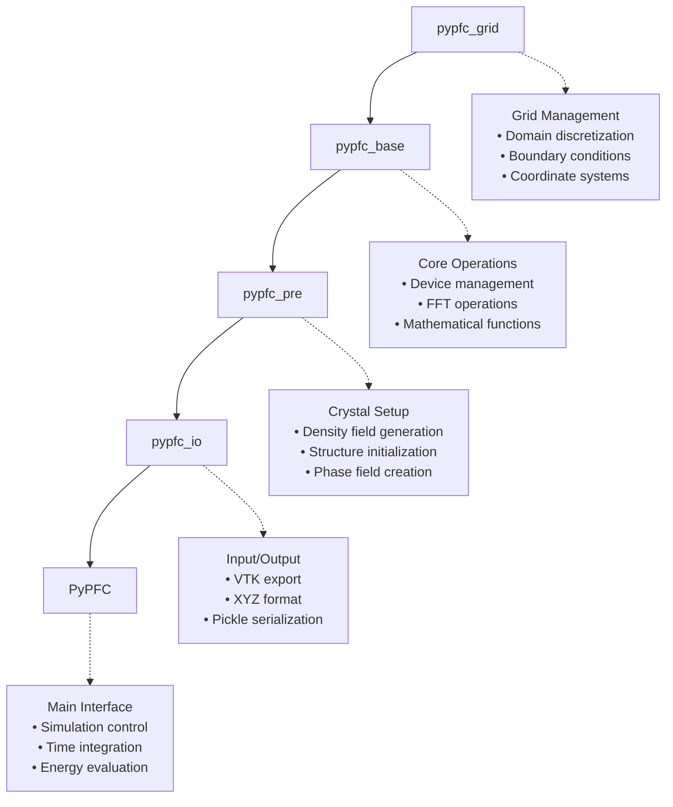

# Core Classes

This section documents the core classes of the pyPFC framework.

## PyPFC Main Class

The main interface class for Phase Field Crystal simulations.

### Class Overview

```python
class PyPFC:
    """
    Main class for Phase Field Crystal simulations using PyTorch.
    
    This class provides a high-level interface for setting up and running
    PFC simulations on both CPU and GPU devices.
    """
    
    def setup_simulation(self, domain_size, ndiv, config=None):
        """Setup simulation domain and parameters."""
        pass
        
    def do_single_crystal(self):
        """Initialize single crystal structure."""
        pass
        
    def do_step_update(self):
        """Perform one time integration step."""
        pass
        
    def get_energy(self):
        """Calculate and return system free energy."""
        pass
```

## Architecture Overview

The pyPFC framework follows a strict inheritance hierarchy designed for modularity and extensibility:



## Class Descriptions

### Grid Management (pypfc_grid)

Base class handling spatial discretization and domain setup.

**Key Responsibilities:**
- 3D Cartesian grid initialization
- Periodic boundary condition setup
- Coordinate system management
- Grid validation (even number requirements)

**Important Methods:**
- `set_ndiv()` - Set grid divisions
- `set_domain_size()` - Define physical domain
- `get_grid_spacing()` - Calculate grid resolution

### Base Operations (pypfc_base)

Core mathematical and computational operations.

**Key Responsibilities:**
- Device management (CPU/GPU)
- FFT operations and wave vector calculations
- Tensor memory management
- Precision control (single/double)

**Important Methods:**
- `set_device_type()` - Configure computation device
- `setup_fft()` - Initialize Fourier transforms
- `get_k2_field()` - Wave vector calculations

### Crystal Preprocessing (pypfc_pre)

Crystal structure generation and initialization.

**Key Responsibilities:**
- Density field creation
- Crystal structure setup (BCC, FCC)
- Polycrystal initialization
- Phase field preparation

**Important Methods:**
- `setup_crystal_structure()` - Define crystal type
- `generate_density_field()` - Create initial density
- `apply_crystal_orientation()` - Set grain orientations

### Input/Output (pypfc_io)

Data persistence and visualization support.

**Key Responsibilities:**
- File format support (VTK, XYZ, pickle)
- Atomic position export
- Density field visualization
- Simulation state serialization

**Important Methods:**
- `write_vtk_points()` - Export to ParaView format
- `write_extended_xyz()` - Export for OVITO/VMD
- `save_simulation_state()` - Checkpoint creation

### Main Interface (PyPFC)

High-level simulation control and user interface.

**Key Responsibilities:**
- Simulation setup and configuration
- Time integration control
- Energy evaluation and monitoring
- Results analysis and extraction

**Main Methods:**
- `setup_simulation()` - Initialize complete simulation
- `do_step_update()` - Advance time integration
- `get_energy()` - Calculate free energy
- `interpolate_density_maxima()` - Extract atomic positions

## Usage Patterns

### Basic Initialization

```python
import pypfc

# Create simulation instance
pfc = pypfc.PyPFC()

# Setup simulation domain
domain_size = [32.0, 32.0, 8.0]  # Physical size
ndiv = [64, 64, 16]               # Grid divisions

# Configuration
config = {
    'device_type': 'GPU',
    'dtype_gpu': 'double',
    'update_scheme': 'exponential'
}

# Initialize simulation
pfc.setup_simulation(domain_size, ndiv, config)
```

### Advanced Configuration

```python
# Comprehensive configuration
config = {
    # Device settings
    'device_type': 'GPU',           # 'CPU' or 'GPU'
    'device_number': 0,             # GPU device index
    'dtype_gpu': 'double',          # 'single' or 'double'
    
    # Simulation parameters
    'update_scheme': 'exponential', # Time integration method
    'update_scheme_params': [1.0, 0.01],  # [dt, tolerance]
    'max_iterations': 1000,         # Maximum steps per update
    
    # Crystal structure
    'crystal_structure': 'BCC',     # 'BCC', 'FCC', 'HCP'
    'lattice_parameter': 1.0,       # Crystal lattice spacing
    
    # Density field
    'density_amplitude': 1.0,       # Field amplitude
    'density_threshold': 0.5,       # Atom detection threshold
    'density_interp_order': 2,      # Interpolation accuracy
    
    # Polycrystal settings
    'grain_seeds': [3, 3],          # Number of grains [nx, ny]
    'grain_orientations': 'random', # Orientation distribution
    'grain_boundary_width': 2.0,    # GB thickness
    
    # Output control
    'output_frequency': 10,         # Steps between outputs
    'output_format': 'vtk',         # Output file format
    'output_precision': 'single'    # Output data precision
}
```

## Error Handling

### Common Exceptions

```python
try:
    pfc.setup_simulation(domain_size, ndiv, config)
except ValueError as e:
    print(f"Configuration error: {e}")
except RuntimeError as e:
    print(f"GPU/memory error: {e}")
except Exception as e:
    print(f"Unexpected error: {e}")
```

### Validation Methods

```python
# Check configuration validity
is_valid = pfc.validate_configuration(config)
if not is_valid:
    print("Configuration validation failed")

# Check GPU availability
if not pfc.check_gpu_available():
    config['device_type'] = 'CPU'
    print("GPU not available, using CPU")

# Validate grid dimensions
if not pfc.validate_grid_dimensions(ndiv):
    print("Grid dimensions must be even numbers")
```

## Performance Considerations

### Memory Usage

| Grid Size | Single Precision | Double Precision |
|-----------|------------------|------------------|
| 64³ | ~1 GB | ~2 GB |
| 128³ | ~8 GB | ~16 GB |
| 256³ | ~64 GB | ~128 GB |

### Optimization Tips

```python
# For maximum performance
config_fast = {
    'device_type': 'GPU',
    'dtype_gpu': 'single',          # Faster computation
    'update_scheme': 'exponential', # Efficient time stepping
    'fft_backend': 'cufft',         # GPU-optimized FFT
    'memory_pool': True,            # Reuse GPU memory
}

# For maximum accuracy
config_precise = {
    'device_type': 'GPU',
    'dtype_gpu': 'double',          # Higher precision
    'update_scheme': '2nd_order',   # More accurate integration
    'convergence_tolerance': 1e-8,  # Stricter convergence
    'density_interp_order': 3,      # Better interpolation
}
```

## Thread Safety

!!! warning "Thread Safety"
    PyPFC instances are **not thread-safe**. For parallel simulations:
    
    - Use separate PyPFC instances per thread
    - Ensure different GPU devices per instance
    - Avoid shared state between instances

```python
# Correct: separate instances
def run_simulation(config, thread_id):
    pfc = pypfc.PyPFC()  # New instance per thread
    config['device_number'] = thread_id % torch.cuda.device_count()
    pfc.setup_simulation(domain_size, ndiv, config)
    # ... run simulation
```

## Next Steps

- [Grid Management API](grid.md) - Detailed grid operations
- [I/O Operations API](io.md) - File handling and export
- [Usage Examples](../usage/basic.md) - Practical applications