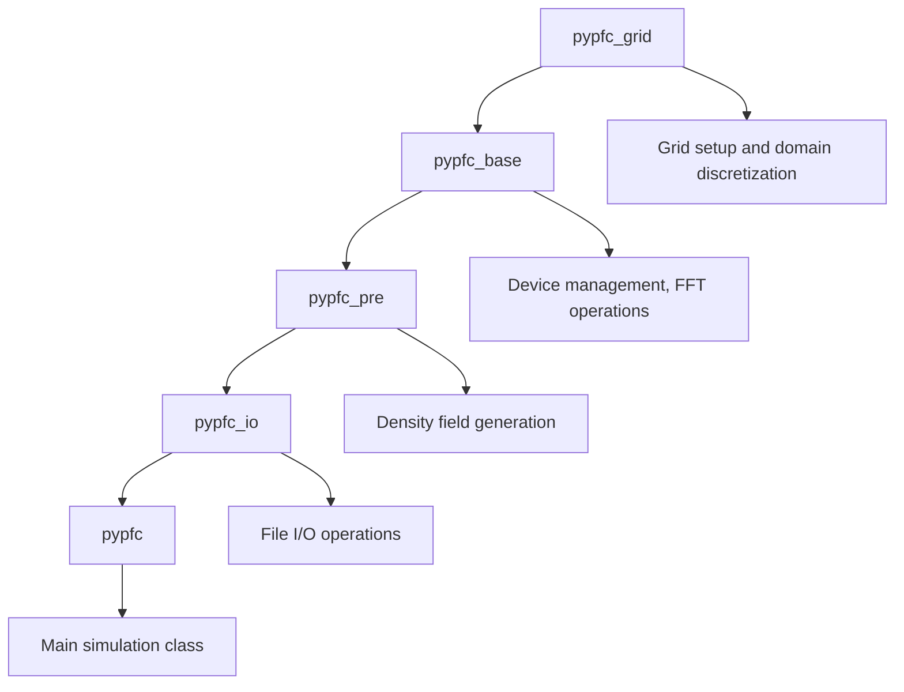

# pyPFC: Phase Field Crystal Simulations

Welcome to **pyPFC**, a Python package for Phase Field Crystal (PFC) simulations using PyTorch for CPU/GPU acceleration.


## Overview

pyPFC is a high-performance simulation framework designed for modeling crystal structures and their evolution using the Phase Field Crystal method. The package leverages PyTorch's tensor operations and automatic differentiation capabilities to provide efficient simulations on both CPU and GPU platforms.

### Key Features

- **GPU Acceleration**: Full GPU support using PyTorch for large-scale simulations
- **Flexible Architecture**: Modular design with inheritance-based class structure
- **Multiple Crystal Structures**: Support for BCC, FCC, and custom crystal structures
- **Advanced I/O**: VTK, XYZ, and pickle format support for data exchange
- **Visualization Integration**: Built-in support for OVITO analysis (optional)
- **Memory Optimization**: Efficient memory management for large 3D grids

### Core Capabilities

- **Grid Management**: Flexible 3D Cartesian grid setup with periodic boundary conditions
- **Density Field Evolution**: Multiple time integration schemes (1st order, 2nd order, exponential)
- **Energy Calculations**: Free energy evaluation and minimization
- **Structure Analysis**: Crystal structure identification and defect analysis
- **Polycrystal Modeling**: Multi-grain systems with grain boundary modeling

## Quick Start

```python
import numpy as np
import pypfc

# Setup simulation parameters
nx, ny, nz = 64, 64, 64
dx, dy, dz = 0.5, 0.5, 0.5
config = {
    'device_type': 'GPU',
    'dtype_gpu': 'double'
}

# Initialize PFC simulation
pfc = pypfc.PyPFC()
pfc.setup_simulation([nx*dx, ny*dy, nz*dz], [nx, ny, nz], config)

# Create single crystal
pfc.do_single_crystal()

# Run simulation steps
for step in range(100):
    pfc.do_step_update()
    
    if step % 10 == 0:
        energy = pfc.get_energy()
        print(f"Step {step}: Energy = {energy:.6f}")
```

## Architecture

The pyPFC package follows a strict inheritance hierarchy designed for modularity and extensibility:



## Scientific Applications

pyPFC is designed for research in:

- **Materials Science**: Crystal growth, phase transitions, microstructure evolution
- **Computational Physics**: Nonlinear dynamics, pattern formation, phase field modeling
- **Metallurgy**: Grain boundary dynamics, recrystallization, texture evolution
- **Solid State Physics**: Defect formation and migration, elastic interactions

## Performance

- **Memory Efficient**: Optimized tensor operations with in-place computations
- **Scalable**: Supports simulations from small test cases to large-scale production runs
- **Cross-Platform**: Compatible with various GPU architectures through PyTorch

## Getting Started

1. [Installation Guide](installation.md) - Setup instructions and dependencies
2. [Quick Start Tutorial](quick_start.md) - Your first PFC simulation
3. [Examples](examples.md) - Comprehensive examples and use cases
4. [API Reference](api/core.md) - Detailed class and method documentation

## Support and Community

- **Documentation**: Comprehensive guides and API reference
- **Examples**: Jupyter notebooks with detailed explanations
- **GitHub Issues**: Bug reports and feature requests
- **Discussions**: Community support and questions

---

*pyPFC is developed with a focus on computational efficiency and scientific rigor, making it suitable for both research and educational purposes in phase field crystal modeling.*
