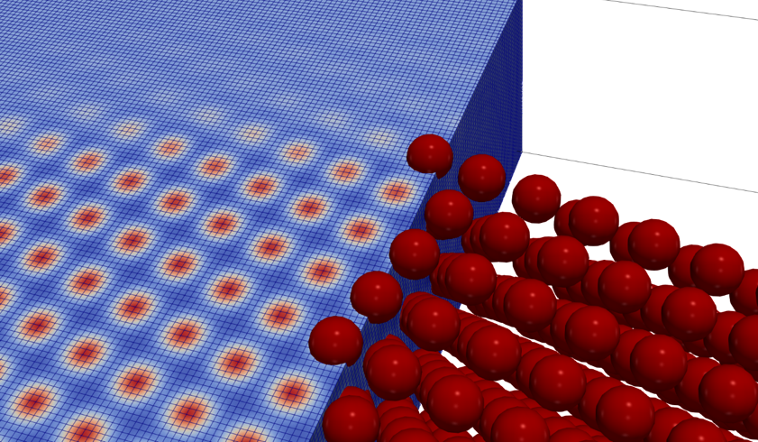

# A Python package for GPU-accelerated 3D Phase Field Crystal simulations

## Overview

pyPFC is a high-performance simulation framework designed for modeling crystal structures and their evolution using the Phase Field Crystal (PFC) method. The code uses PyTorch to allow execution on both CPUs and GPUs, providing efficient simulations on both CPU and GPU platforms. pyPFC is developed with a combined focus on computational efficiency, flexibility and accessibility, making it suitable for both research and educational purposes. Areas of application include:

- **Materials Science**: Crystal growth and microstructure evolution
- **Computational Physics**: Pattern formation, defect evolution and elastic interactions
- **Metallurgy**: Grain boundary and dislocation mechanics

## Key Features

- **GPU Acceleration**: Full GPU support using PyTorch for large-scale simulations
- **Adjustable Floating Point Precision**: Permits optimized use of GPU memory resources and execution efficiency
- **Flexible I/O**: VTK, Extended XYZ and pickle format support for data exchange
- **Advanced Data Processing**: Built-in functionalities as well as interfaces to [OVITO](https://www.ovito.org/) libraries (optional)
- **Memory Optimization**: Efficient memory management for large 3D grids
- **Density Field Evolution**: Multiple time integration schemes are available

## Getting Started

1. [Installation Guide](installation.md) - Setup instructions and dependencies
2. [Quick Start Tutorial](quick_start.md) - Run your first pyPFC simulation
3. [Examples](examples.md) - Comprehensive examples and use cases
4. [API Reference](api/core.md) - Detailed class and method documentation
5. [Troubleshooting](troubleshooting.md) - Q&A

## Licencing

This software is released under a [GNU GPLv3 license](https://www.gnu.org/licenses/).

## References

Further details on PFC modeling and example applications can be found in:

1. [K.H. Blixt and H. Hallberg, **Phase Field Crystal Modeling of Grain Boundary Migration: Mobility, Energy and Structural Variability**, *Acta Materialia*, 297:121318, 2025](https://doi.org/10.1016/j.actamat.2025.121318)
2. [H. Hallberg and K.H. Blixt, **Assessing grain boundary variability through phase field crystal simulations**, *Physical Review Materials*, 8(3):113605, 2024](https://doi.org/10.1103/PhysRevMaterials.8.113605)
3. [K.H. Blixt and H. Hallberg, **Phase field crystal modeling of grain boundary structures in diamond cubic systems**, *Physical Review Materials*, 8(3):033606, 2024](https://doi.org/10.1103/PhysRevMaterials.8.033606)
4. [H. Hallberg and K.H. Blixt, **Multiplicity of grain boundary structures and related energy variations**, *Materials Today Communications*, 38:107724, 2024](https://doi.org/10.1016/j.mtcomm.2023.107724)
5. [H. Hallberg and K.H. Blixt, **Evaluation of Nanoscale Deformation Fields from Phase Field Crystal Simulations**, *Metals*, 12(10):1630, 2022](https://doi.org/10.3390/met12101630)
6. [K.H. Blixt and H. Hallberg, **Grain boundary and particle interaction: Enveloping and pass-through mechanisms studied by 3D phase field crystal simulations**, *Materials & Design*, 220:110845, 2022](https://doi.org/10.1016/j.matdes.2022.110845)
7. [K.H. Blixt and H. Hallberg, **Grain boundary stiffness based on phase field crystal simulations**, *Materials Letters*, 318:132178, 2022](https://doi.org/10.1016/j.matlet.2022.132178)
8. [K.H. Blixt and H. Hallberg, **Evaluation of grain boundary energy, structure and stiffness from phase field crystal simulations**, *Modelling and Simulation in Materials Science and Engineering*, 30(1):014002, 2022](https://doi.org/10.1088/1361-651X/ac3ca1)
